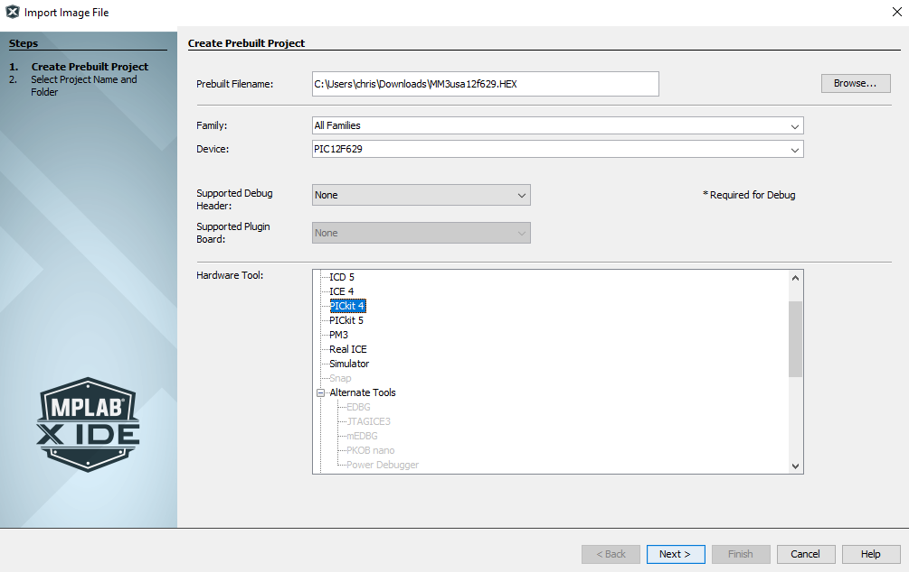

# Additional steps for creating a MM3 modchip

I was following this [excellent guide by William Quade](https://quade.co/ps1-modchip-guide/mm3/) on how to
install the "MM3" modchip.

Unfortunately it ends with this statement:

> I’ll have a tutorial on how to program these PIC chips in the future.

The oldest comment seems to be from 2018, so I am not certain if this guide is coming.
So, since I'm figuring this out anyways, I figured I'd write up the steps I followed here.
Most of my experience is with Arduino, which obscures some of the details of flashing
away from the user for simplicity.

I actually first heard about this method [from this MattKC video](https://www.youtube.com/watch?v=INxyKrcYNoE). I never owned this
console originally, and was fine with emulation most of the time.

When rewatching this video, I missed the point about there also being an Arduino-based modchip "PsNee". I actually only noticed this after I already bought a PIC. Oh well, I guess this is an excuse to learn how to program PIC. Maybe I'll use it if this doesn't work.

## 1. Get the parts

[From the original blog post, I purchased the following](https://www.youtube.com/watch?v=INxyKrcYNoE):

| Item | Description |
| ---- | ---- |
| Used PS1 | Bought one claimed to be working on Ebay. Really could use a clean when I'm done. It has a SCPH-9000 board. | 
| PIC12F629 SOIC-8 | Opted for the SOIC-8 package for this chip, because it was smaller. |
| SOIC-8 breakout board | I had a few SOIC-14 breakout boards already lying around, and what's a SOIC-8 but a SOIC-14 minus 6? |
| PICkit 3 Programmer | Bought a knockoff from AliExpress. |

## 2. Program it

I first soldered the PIC chip to my SOIC-8 breakout board, and put it on a breadboard.

I then connected the PIC programmer to the PIC chip based on [this datasheet](https://ww1.microchip.com/downloads/en/DeviceDoc/41173c.pdf) and the breakout for the PICkit 3.

This is the part which was missing from other guides and the video I checked earlier. Probably because it's not exciting and assumed knowledge.

[The `.hex` for the region of PS1 and PIC chip I was using was available from William Quade's blog.](https://quade.co/files/ps1/mm3/pic12f629/MM3usa12f629.HEX)

### The steps that didn't work

[I downloaded PICPgm](http://picpgm.picprojects.net/download.html) and [the .hex for the region and type of PIC chip I was using](https://quade.co/files/ps1/mm3/pic12f629/MM3usa12f629.HEX)

When I launched PICPgm, I saw this error in the Log when trying to "Autodetect Programmer" (and then "Autodetect PIC"):

```
Autodetecting Programmer ...
Warning: Unable to open parallel port I/O driver!
Installing driver requires admin/root rights.
No Programmer found! Check connection!
No PIC detected!
```

Re-running as Admin didn't prompt it to install any drivers. The Power and Active lights on the programmer were on, so that seems to be fine.

Also, I found this when hunting around for drivers:

> The PICkit 3 is not recommended for new designs and no new device support will be added to it as of June 1, 2019.

Sounds about right.

Since I was having what seemed to be driver issues, I tried downloading the MPLAB X IDE software, to see if that would fix it.

After installing MPLAB and drivers, PICPgm still couldn't detect it. I also tried another USB port just in case that was the cause. I did not install any compilers, because I already have the compiled `.hex` file.

When I used MPLAB to create a "prebuilt" project, the PICkit 3 was not listed as a compatible hardware tool. I tried selecting the PICkit 4 to see if that would work.



So this didn't seem to work, because the PICkit 3 was not compatible.

Instead I found this page https://microchipdeveloper.com/pickit3:scripttool which had a link to the archive for the PICKit 3 software. My browser complained about this because it was downloading over plain HTTP.

<!-- TODO, restarting to see if this resolves drivers -->