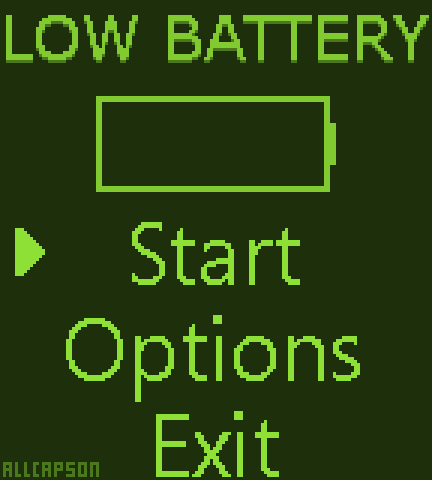
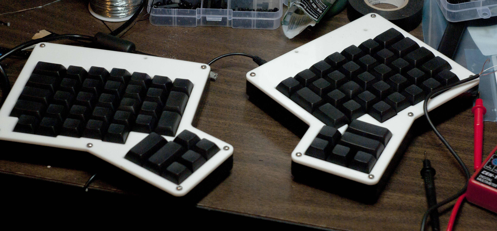

## Pictures

Low Battery, a game created for GBJam 4 in 10 days from scratch.

 

A game of Snake, using an Arduino and custom-made controller and display.

 

A clock whose purpose is to inform onlookers that it is not a bomb.

 

My ErgoDox mechanical keyboard with Cherry MX Clear switches that I sourced parts for and assembled.

 

Some RGB lights being controlled via Arduino.

 

An image of my Internet-Xmas-Tree in use.

I am a University of Washington Bothell student who likes to make things in my spare time.

In terms of programming, I've worked with
- Arduino
- C++
- C#
- HTML, CSS, Javascript
- Java
- PHP
- Python
- SQL
- XAML
- XML

_And I'm probably forgetting something._

I enjoy using both the Arduino and Raspberry Pi platforms for making things.

Please refer to [my Github page](https://github.com/chris-johnston) to check out some of the things I've made.