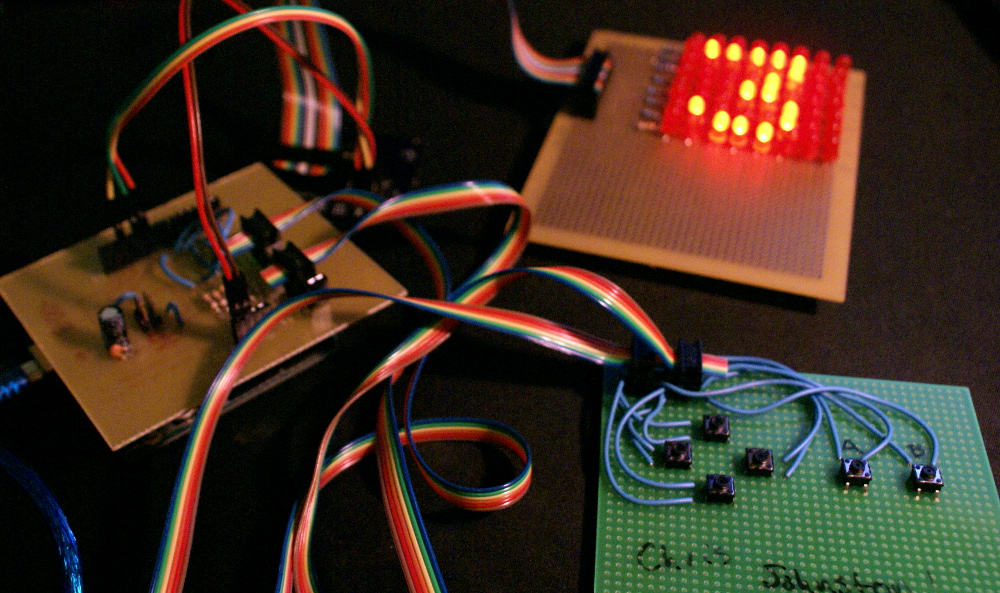

I am a student who makes things in my free time. GitHub: [Chris-Johnston](https://github.com/chris-johnston).

## Things I've Made

### Internet-Xmas-Tree
Link: [Internet-Xmas-Tree](https://github.com/Chris-Johnston/Internet-Xmas-Tree)

The Internet-controlled Xmas tree from the future. 600 RGB leds that animate and change colors.

### BinaryKeyboard

A two-button, mechanical keyboard with backlighting and a screen. Also, it types in binary.

Link: [BinaryKeyboard](https://github.com/Chris-Johnston/BinaryKeyboard) [Build Log]()

### ErgoDox Build

My ErgoDox mechanical keyboard with Cherry MX Clear switches that I sourced parts for and assembled. [Build Log]()

 

### Etc.

Low Battery, a game created for GBJam 4 in 10 days from scratch.

 

Arduino implementation of Snake, using a few hand-made circuitboards.

 

A clock. (Not a bomb!)

 
